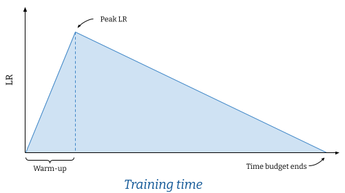

# Training BERT with Compute/Time (Academic) Budget

This repository contains scripts for pre-training and finetuning BERT-like models with limited time and compute budget.
The code is based on the work presented in the following paper:

Peter Izsak, Moshe Berchansky, Omer Levy, [How to Train BERT with an Academic Budget](https://arxiv.org/abs/2104.07705) - (to appear at EMNLP 2021).

## Installation

The pre-training and finetuning scripts are based on [Deepspeed](https://github.com/microsoft/DeepSpeed) and HuggingFace [Transformers](https://github.com/huggingface/transformers) libraries.

### Preliminary Installation

We recommend creating a virtual environment with python 3.6+, PyTorch and [`apex`](https://github.com/NVIDIA/apex).

### Installation Requirements
```bash
pip install -r requirements.txt
```

We suggest running Deepspeed's utility `ds_report` and verify Deepspeed components can be compiled (JIT).

## Dataset

The [`dataset`](dataset/) directory includes scripts to pre-process the datasets we used in our experiments (Wikipedia, Bookcorpus). See dedicated [README](dataset/README.md) for full details.

## Pretraining

Pretraining script: `run_pretraining.py`

For all possible pretraining arguments see: `python run_pretraining.py -h`

We highly suggest reviewing the various [training features](#time-based-training) we provide within the library.

##### Example for training with the best configuration presented in our paper (24-layers/1024H/time-based learning rate schedule/fp16):

```bash
deepspeed run_pretraining.py \
  --model_type bert-mlm --tokenizer_name bert-large-uncased \
  --hidden_act gelu \
  --hidden_size 1024 \
  --num_hidden_layers 24 \
  --num_attention_heads 16 \
  --intermediate_size 4096 \
  --hidden_dropout_prob 0.1 \
  --attention_probs_dropout_prob 0.1 \
  --encoder_ln_mode pre-ln \
  --lr 1e-3 \
  --train_batch_size 4096 \
  --train_micro_batch_size_per_gpu 32 \
  --lr_schedule time \
  --curve linear \
  --warmup_proportion 0.06 \
  --gradient_clipping 0.0 \
  --optimizer_type adamw \
  --weight_decay 0.01 \
  --adam_beta1 0.9 \
  --adam_beta2 0.98 \
  --adam_eps 1e-6 \
  --total_training_time 24.0 \
  --early_exit_time_marker 24.0 \
  --dataset_path <dataset path> \
  --output_dir /tmp/training-out \
  --print_steps 100 \
  --num_epochs_between_checkpoints 10000 \
  --job_name pretraining_experiment \
  --project_name budget-bert-pretraining \
  --validation_epochs 3 \
  --validation_epochs_begin 1 \
  --validation_epochs_end 1 \
  --validation_begin_proportion 0.05 \
  --validation_end_proportion 0.01 \
  --validation_micro_batch 16 \
  --deepspeed \
  --data_loader_type dist \
  --do_validation \
  --use_early_stopping \
  --early_stop_time 180 \
  --early_stop_eval_loss 6 \
  --seed 42 \
  --fp16
```

### Time-based Training

Pretraining can be limited to a time-based value by defining `--total_training_time=24.0` (24 hours for example).

### Time-based Learning Rate Scheduling

The learning rate can be scheduled to change according to the configured total training time. The argument `--total_training_time` controls the total time assigned for the trainer to run, and must be specified in order to use time-based learning rate scheduling.

<p align="center">

</p>

To select time-based learning rate scheduling, define `--lr_schedule time`, and define a shape for for the annealing curve (`--curve=linear` for example, as seen in the figure). The warmup phase of the learning rate is define by specifying a proportion (`--warmup_proportion`) which accounts for the time-budget proportion available in the training session (as defined by `--total_training_time`). For example, for a 24 hour training session, `warmup_proportion=0.1` would account for 10% of 24 hours, that is, 2.4 hours (or 144 minutes) to reach peak learning rate. The learning rate will then be scheduled to reach 0 at the end of the time budget. We refer to the provided figure for an example.

### Checkpoints and Finetune Checkpoints

There are 2 types of checkpoints that can be enabled:

- Training checkpoint - saves model weights, optimizer state and training args. Defined by `--num_epochs_between_checkpoints`.
- Finetuning checkpoint - saves model weights and configuration to be used for finetuning later on. Defined by `--finetune_time_markers`.

`finetune_time_markers` can be assigned multiple points in the training time-budget by providing a list of time markers of the overall training progress. For example `--finetune_time_markers=0.5` will save a finetuning checkpoint when reaching 50% of training time budget. For multiple finetuning checkpoints, use commas without space `0.5,0.6,0.9`.

### Validation Scheduling

Enable validation while pre-training with `--do_validation`

Control the number of epochs between validation runs with `--validation_epochs=<num>`

To control the amount of validation runs in the beginning and end (running more that `validation_epochs`) use `validation_begin_proportion` and `validation_end_proportion` to specify the proportion of time and, `validation_epochs_begin` and `validation_epochs_end` to control the custom values accordingly. 

### Mixed Precision Training

Mixed precision is supported by adding `--fp16`. Use `--fp16_backend=ds` to use Deepspeed's mixed precision backend and `--fp16_backend=apex` for `apex` (`--fp16_opt` controls optimization level).

## Finetuning

Use `run_glue.py` to run finetuning for a saved checkpoint on GLUE tasks. 

The finetuning script is identical to the one provided by Huggingface with the addition of our model.

For all possible pretraining arguments see: `python run_glue.py -h`

##### Example for finetuning on MRPC:

```bash
python run_glue.py \
  --model_name_or_path <path to model> \
  --task_name MRPC \
  --max_seq_length 128 \
  --output_dir /tmp/finetuning \
  --overwrite_output_dir \
  --do_train --do_eval \
  --evaluation_strategy steps \
  --per_device_train_batch_size 32 --gradient_accumulation_steps 1 \
  --per_device_eval_batch_size 32 \
  --learning_rate 5e-5 \
  --weight_decay 0.01 \
  --eval_steps 50 --evaluation_strategy steps \
  --max_grad_norm 1.0 \
  --num_train_epochs 5 \
  --lr_scheduler_type polynomial \
  --warmup_steps 50
```


## Generating Pretraining Commands

We provide a useful script for generating multiple (or single) pretraining commands by using `python generate_training_commands.py`.

```bash
python generate_training_commands.py -h

	--param_file PARAM_FILE Hyperparameter and configuration yaml
  	--job_name JOB_NAME   job name
 	--init_cmd INIT_CMD   initialization command (deepspeed or python directly)
```

A parameter yaml must be defined with 2 main keys: `hyperparameters` with argument values defined as a list of possible values, and `default_parameters` as default values. Each generated command will be a possible combination of the various arguments specified in the `hyperparameters` section.

Example:

```yaml
hyperparameters:
  param1: [val1, val2]
  param2: [val1, val2]

default_parameters:
  param3: 0.0
```

will result in:

```bash
deepspeed run_pretraining.py --param1=val1 --param2=val1 --param3=0.0
deepspeed run_pretraining.py --param1=val1 --param2=val2 --param3=0.0
deepspeed run_pretraining.py --param1=val2 --param2=val1 --param3=0.0
deepspeed run_pretraining.py --param1=val2 --param2=val2 --param3=0.0
```

## Citation

If you find this paper or this code useful, please cite this paper:

```
@article{izsak2021,
  author={Izsak, Peter and Berchansky, Moshe and Levy, Omer},
  title={How to Train BERT with an Academic Budget},
  journal={arXiv preprint arXiv:2104.07705},
  url = {https://arxiv.org/abs/2104.07705} 
  year={2021}
}
```
